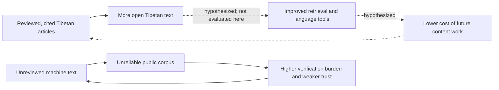

# Expanding the Digital Footprint of Tibetan

## A Verification-Gated Pipeline for Drafting Wikipedia Articles with Large Language Models

**Tashi Tsering**  
The OpenPecha Project  
<tashitsering@dharmaduta.in>

> **Manuscript scope.** This version reports a system and an exploratory three-article pilot. It does not claim that the system has improved Tibetan Wikipedia, reduced human editorial labour, or produced publication-ready articles. No article generated in the reported work has been published to the live wiki. Human evaluation, statement-support evaluation, a manual-writing baseline, a zero-shot baseline, and a rights review remain future work.

## Abstract

Tibetan is spoken by more than seven million people and supports a large classical and modern literary tradition, but it remains under-represented in open digital text and contemporary language technology. This paper describes a semi-automatic pipeline for producing reviewable Tibetan-language Wikipedia drafts from a Tibetan root text and its commentaries. The system combines conservative source preparation, structure extraction, verse alignment, atomic claims extraction, question-driven consolidation, claims-only drafting, deterministic quotation and locator checks, independent model auditing, and human-controlled publication. The case study uses the *Praise to the Twenty-One Tārās* and sixteen Tibetan commentaries. The project artifacts contain 2,975 source-anchored draft claims, sixteen routing maps, twenty-four draft topic consolidations, three Route A term articles, and three exploratory Route B topic articles. In the evaluated Route A pilot, all 81 rendered quotations across three articles matched their cited source passages after whitespace normalization, and all 81 cited block locators resolved. A same-model audit initially returned no findings on all three drafts, whereas a separate cross-model audit identified five blocking findings in two drafts; project-side adjudication classified four as genuine and one as borderline. After targeted revisions, all three drafts passed both the cross-model audit and deterministic gate. These results establish quotation fidelity for this small pilot and illustrate the value of verification layers with different failure modes. They do not establish statement-level support, native-speaker quality, editorial efficiency, notability, or general performance at scale.

**Keywords:** Tibetan; under-resourced languages; Wikipedia; large language models; grounded generation; citation verification; digital humanities

## 1. Introduction

Tibetan has a substantial literary heritage and more than seven million speakers, yet it is under-represented in many digital resources and language-technology evaluations (Gao et al. 2025). On 10 August 2026, the Tibetan Wikipedia API reported 8,073 content articles, 35 active users, and two administrators (Wikimedia Foundation 2026a). These figures are a dated snapshot rather than a stable description of the community.

Recent language-model evaluations reinforce the resource gap. On the choice-answer accuracy measure reported by TLUE, GPT-4 scored 17.51 and Qwen-2.5-72B scored 16.50 in Tibetan, below the benchmark's 25-point random baseline; the same Qwen model scored 84.70 in Chinese (Gao et al. 2025). These values apply to the models, tasks, prompts, and metric used by TLUE and should not be generalized to every form of Tibetan language use. Petrov et al. (2023) also document large cross-language differences in tokenization and byte-level representation. Their result shows an encoding disparity; it does not imply that every tokenizer or commercial API charges exactly four times more for Tibetan.

Open encyclopedic text is one part of a language's digital presence. The proportion of a language in pretraining data correlates with model performance across languages, although the contribution of any one source, including Wikipedia, is often undisclosed (Li et al. 2025). Increasing high-quality Tibetan text could therefore benefit research, search, education, and language technology. That possible downstream benefit is a motivation for this work, not an outcome evaluated here.

Automated content creation also creates substantial risks. In September 2025, the Wikimedia Language Committee accepted the closure of Greenlandic Wikipedia after finding that the project lacked a viable editing community and contained machine-generated material that was often unintelligible or misleading (Wikimedia contributors 2025). English Wikipedia's G15 criterion similarly targets pages that show clear signs of unreviewed large-language-model generation, including nonsensical references or unfilled placeholders that reasonable human review should have removed (Wikipedia contributors 2026). These cases do not show that every assisted workflow fails. They show that publication authority, review capacity, traceability, and community governance cannot be treated as optional.

This paper presents a pipeline designed around that constraint. It converts a Tibetan root text and a set of commentaries into source-addressable evidence, typed claims, topic consolidations, and Tibetan Wikipedia drafts. A language model may propose structure, classify passages, consolidate claims, and draft prose. It cannot waive a deterministic failure, promote an artifact to complete, establish Wikipedia notability, or publish an article.

The case study is the *Praise to the Twenty-One Tārās* (སྒྲོལ་མ་ལ་ཕྱག་འཚལ་ཉི་ཤུ་རྩ་གཅིག་གིས་བསྟོད་པ, Toh. 438) and sixteen Tibetan commentaries from several traditions. This is a bounded and heavily commented text for which generated statements can be traced to named sources. At the time of writing, the pipeline has produced three fully processed Route A term drafts and three exploratory Route B topic drafts. None has been published.



*Figure 1. Two possible feedback paths. The harmful path is documented in small-wiki governance cases; the beneficial downstream path is a motivation and remains to be evaluated.*

This paper makes four contributions:

1. It describes an end-to-end, verification-gated workflow from OCR-derived Tibetan sources to cited Tibetan Wikipedia drafts.
2. It reports an exploratory comparison in which a same-model audit missed findings later raised by a separate model.
3. It documents an error taxonomy derived from checking 418 citations in three draft topic consolidations and shows how several error classes were converted into executable checks.
4. It describes a draft claims dataset over a verse-aligned commentarial corpus while identifying the review and rights work required before release.

The evaluation addresses two research questions:

- **RQ1 — quotation fidelity:** In the three Route A pilot articles, do rendered quotations match the cited source text, and do their block locators resolve?
- **RQ2 — layered verification:** What additional problems are identified when deterministic checks, same-model review, cross-model review, and human judgment are kept separate?

The study does not yet answer whether the drafts are acceptable to native-speaker editors, whether every cited passage supports the sentence that cites it, whether assisted drafting saves reviewer time, or whether the pipeline can operate reliably at Wikipedia scale.

## 2. Related work

### 2.1 Systems for grounded article generation

STORM separates research, perspective discovery, outlining, and long-form article generation and evaluates both organization and breadth with Wikipedia editors (Shao et al. 2024). Co-STORM extends this line of work by allowing a human to observe and steer a multi-agent research conversation (Jiang et al. 2024). WikiChat uses retrieval and a grounding filter to retain supported facts in conversational answers (Semnani et al. 2023). These systems motivate the separation of evidence collection, organization, drafting, and evaluation used here.

WikiCrow, built on PaperQA2, offers a useful comparison for citation evaluation. Skarlinski et al. (2024) sampled 375 statements from 240 paired WikiCrow and Wikipedia articles and had blinded experts classify them as cited-and-supported, uncited, or cited-and-unsupported. In that sample, 13.5% of all WikiCrow statements were cited but unsupported, and citation precision among cited statements was 86.1%. The denominator matters: 13.5% is not the proportion of cited statements that were unsupported.

XWikiGen frames low-resource encyclopedic generation as cross-lingual multi-document summarization over cited references (Taunk et al. 2023). The present pipeline differs in taking Tibetan commentarial text as its primary evidence layer, preserving Tibetan quotations and block locators, and treating publication as a separate human-governed operation. This combination appears not to have been reported previously for Tibetan, but the present review should not be read as an exhaustive systematic literature search.

### 2.2 Attribution, fidelity, and support

Citation quality has at least three distinct components:

1. **Existence:** the cited source or identifier exists.
2. **Fidelity:** the quoted evidence matches the source and the locator resolves.
3. **Support:** the cited passage warrants the claim made in the article.

The deterministic gate reported here evaluates the second component and part of the first. It cannot determine semantic support. A genuine quotation may be irrelevant, too narrow, or attached to an overgeneralized sentence. Support therefore requires a separate audit and, for publication, qualified human judgment.

### 2.3 Wikipedia and under-resourced language communities

Assisted creation is not a single intervention. It ranges from tools that reduce formatting work to systems that produce complete drafts. A 2015 evaluation of Wikipedia Content Translation reported a deletion rate below 1% among approximately 900 articles created during an opt-in period. The authors explicitly cautioned that participants were self-selected and mostly experienced editors, so the result could not be generalized to the wider community (Laxström et al. 2015). The relevant lesson is that the social and review conditions of deployment matter.

The Welsh Language Technology Action Plan provides a positive example of sustained public investment in language content. Its final report records growth in Welsh Wikipedia articles from 101,008 in 2018 to 279,643 in 2023 alongside funded workshops and content support (Welsh Government 2024). The report does not establish that Wikipedia growth caused improvements in Welsh machine translation, so no such causal claim is made here. Participatory projects such as Masakhane likewise show the importance of involving language communities in setting research goals and evaluating outputs (Nekoto et al. 2020).

### 2.4 Tibetan digital infrastructure and rights

The pipeline builds on existing Tibetan digital infrastructure, including BDRC, OpenPecha, ACIP, Adarsha, 84000, and other scholarly and translation projects. Access and reuse conditions differ by work, edition, data layer, and repository. BDRC states that a significant portion of its holdings is public domain and openly accessible, while OCR-derived and manually input texts are assessed case by case and some works are restricted for copyright or cultural reasons (BDRC 2026). 84000 states that its translations use a CC BY-NC-ND licence, while some metadata and glossary data use CC BY; it separately notes that the original Tibetan Kangyur texts are public domain (84000 2026a, 2026b). These policies rule out a blanket repository-level rights assumption. The project must maintain an item-level rights record for every source and output.

## 3. Design requirements

Manual writing, assisted drafting, translation tools, bots, and model-generated drafts are better understood as a continuum of operating modes than as an exhaustive set of alternatives. The present work examines one mode: machine assistance under explicit verification and human publication authority.

The design follows six requirements:

1. **Source wording is immutable during interpretive processing.** Models point to source spans but do not rewrite source files.
2. **Every quotation is mechanically checkable.** A quotation must match source text under a documented normalization rule and must occur inside its cited block.
3. **Model judgment and model authority are separate.** A model may make a linguistic judgment; it may not override deterministic checks or publish.
4. **Disagreement is preserved.** Divergent interpretations, minority positions, and internal uncertainty are represented rather than averaged.
5. **Review state is explicit.** Draft, partial, complete, verified, approved, and published are distinct states with named human owners.
6. **Production transformations require completed inputs.** Artifacts below `complete` may be used only in labeled exploratory runs and cannot enter the validated or publication path.

The sixth rule was formalized after the reported Route B run. Those three Route B drafts were generated from topic pages still marked `draft`; they are therefore described as exploratory and excluded from the main evaluation.

## 4. Corpus and case study

The corpus contains the opening invocation, twenty-one homage stanzas, a closing couplet, and the benefits section (ཕན་ཡོན) of the *Praise to the Twenty-One Tārās*, together with sixteen commentaries. The project reports approximately 540,000 characters of commentary text. Before archival release, the counting script must define whether this value counts Unicode code points or grapheme clusters and whether whitespace and markup are included.

The source inventory is skewed toward Geluk commentaries, with smaller representation from Sakya, Jonang, Nyingma, and Kagyü materials and several entries whose institutional affiliation is not established. Table 1 separates tradition or lineage from genre instead of treating both as one category.

*Table 1. Commentaries in the frozen `tara21` run. Genre labels are descriptive project metadata and require final specialist verification.*

| Siglum | Author or attribution | Tradition or lineage | Genre or scope |
|---|---|---|---|
| TARAC02_DGT | Jetsün Drakpa Gyaltsen | Sakya | *rnam bshad* |
| TARAC03_GDD | Gendün Drub, First Dalai Lama | Geluk | ṭīkā |
| TARAC04_GDG | Gendün Gyatso, Second Dalai Lama | Geluk | *rnam bshad* |
| TARAC05_TRN | Tāranātha | Jonang | *rnam bshad* |
| TARAC06_NDB | Ngülchu Dharmabhadra | Geluk | *rnam bshad* |
| TARAC07_KTK | Könchok Tabkhé | Geluk | ṭīkā |
| TARAC08_DTG | Dorlop Tenga Tulku | Sūryagupta lineage | Benefits section |
| TARAC09_ANON | Anonymous; no colophon | Sūryagupta lineage | *bstod 'grel* |
| TARAC10_DPN | Dombu Pema Namgyal | Not established | Commentary |
| TARAC11_KMT | Karma Maitri | Not established | Condensed commentary |
| TARAC12_PDS | Khenchen Palden Sherab | Nyingma | Word commentary |
| TARAC13_TDZ | Sermé Tsang Geshé Tendzin Dönzang | Geluk | *bstod 'grel* |
| TARAC14_LZD | Geshé Lobzang Dawa, editor | Geluk | Interlinear notes |
| TARAC15_SNT | Sangyé Nyentrul | Not established | Word commentary |
| TARAC16_PSR | Draphar Dramé Sungrab Tulku | Geluk | *rnam bshad*; 2023 edition |
| TARAC17_TSN | Khenpo Tsültrim Namdak | Kagyü | Commentary |

The root text is a project working edition based on two witnesses, not yet a published critical edition. It replaces an OCR export whose stanza segmentation was inconsistent and whose text ended before the benefits section. Project metadata records witness variation at 17 of the 21 homages, including གསེར་སྔོ versus སེར་སྔོ in the third homage. A future philological release should identify the witnesses, editors, collation method, editorial principles, and apparatus.

The corpus is stored as Markdown in an Obsidian vault. Each verse and prose block carries a block identifier used as the internal citation primitive. For example:

```text
ཕྱག་འཚལ་སྒྲོལ་མ་མྱུར་མ་དཔའ་མོ། །
སྤྱན་ནི་སྐད་ཅིག་གློག་དང་འདྲ་མ། །
འཇིག་རྟེན་གསུམ་མགོན་ཆུ་སྐྱེས་ཞལ་གྱི། །
གེ་སར་ཕྱེ་བ་ལས་ནི་བྱུང་མ། ། ^1-1
```

The reported run uses a frozen corpus copy. That source set does not currently match the vault's newer `1-SOURCES` inventory exactly: the Gendün Drub commentary used by the run is absent from the newer inventory and is cited ten times across the three Route A drafts, while a different Dharmabhadra file appears in the newer inventory but not in the frozen run. The mismatch must be resolved before a reproducible public release.

The project also maintains two annotation layers: one associated with structural *sa-bcad* headings and another with flat block IDs and transclusion anchors. Their textual relationship has been checked within the project, but the duplication increases maintenance risk. A release should nominate one canonical source layer and derive the other views deterministically.

## 5. Pipeline

```mermaid
flowchart LR
    A["Source registry and rights record"] --> B["Cleaning and normalization"]
    B --> C["Segmentation and block IDs"]
    C --> D["Structural tree and alignment"]
    D --> E["Atomic claims"]
    E --> F["Spine maps and topic packets"]
    F --> G["Consolidation and coverage checks"]
    G --> H["Claims-only article drafting"]
    H --> I["Deterministic quotation and locator gate"]
    I --> J["Independent audit"]
    J --> K["Human language, support, rights, and notability review"]
    K --> L["Userspace sandbox"]
    L --> M["Community-approved publication"]

    I -- "fail" --> H
    J -- "blocking finding" --> H
    K -- "reject or revise" --> H
```



*Figure 2. Proposed production path. The reported pilot reaches deterministic and model-audit completion but not independent human approval, sandbox publication, or mainspace publication.*

### 5.1 Source preparation

Cleaning begins with a debris profile presented to a human reviewer. A source-specific cleaner then performs a limited set of mechanical transformations without overwriting the raw file. Doubtful readings and broken syllables are editorial questions and are not silently repaired by the pipeline.

Normalization is implemented as a shared library so that extraction, alignment, and verification use the same definitions:

- `nfc`: Unicode NFC, used for storage;
- `collapse`: NFC with whitespace removed, used by the quotation pass condition;
- `strip_markup`: source text with project annotation removed;
- `fuzzy_key`: punctuation and markup removed, used only to produce a warning.

Segmentation assigns stanza- and block-level identifiers. A no-loss assertion compares normalized pre- and post-segmentation text. If any non-whitespace character changes, the operation aborts without writing a result. Long unresolved spans are sent to human review rather than split speculatively.

Structural annotation identifies the commentary's *sa-bcad*, or topical outline. A model identifies candidate substrings, while deterministic code inserts headings, identifiers, and links using source-attested text. A post-write comparison fails if prose changes.

### 5.2 Structural-tree extraction

Each commentary receives a nested decimal representation of its *sa-bcad*. Extraction is divided into isolated passes for chunking, candidate identification, literal copying of enumeration statements, tree construction, and checking. The author's explicit enumerations constrain the tree: declared children must be represented and sibling counts must agree.

Two checkers serve different purposes. The first tests internal consistency, including ordinal-to-decimal agreement, duplicate addresses, gap-free sibling sequences, and title attestation. The second checks the proposed tree against the commentary itself. The second checker was added after internally consistent trees were found to contain a misattached top-level section, an unresolved anchor, and collided line pointers.

The current source state should not be summarized as sixteen unconditionally clean trees. Fifteen retained valid pointers under the current source versions; one tree requires rechecking because its source was restamped after quality control and its downstream line pointers drifted. Production use of that tree is blocked until the check is rerun.

### 5.3 Alignment

Alignment uses deterministic quotation matching before lexical clustering. Where a commentary quotes a root stanza, the system inserts a transclusion anchor after a dry run. Variant-tolerant matching uses a character-overlap threshold of 0.80 and accepts a single-line match only inside a citation frame such as ཞེས་པ་ནི།. In the project run, successive rule corrections increased the number of anchored verse occurrences from 116 to 209. Word commentaries that dissolve the root into short glosses remain difficult for this method.

Lexical clustering identifies windows in which root-text fragments co-occur and applies a monotonicity constraint because commentaries generally follow the root text in order. A model-proposed span is used only if code can locate it in the source. The run reports 314 aligned spans over 23 root units: 209 from direct anchors and 105 from clustering, with seven of sixteen commentaries reaching full coverage under the project's measure.

The alignment benchmark is preliminary. It reports precision of 95–96% and recall of 51–59% on prose commentaries, and 58% precision and 19% recall on one word commentary, but the current record does not yet supply the benchmark sample size, annotator protocol, per-commentary confusion counts, or uncertainty estimates. It also uses 23 root units in one summary and 22 verse units in the anchor denominator. These definitions must be reconciled before the figures are used as formal evaluation results.

### 5.4 Claims extraction

Claims are extracted one commentary at a time and consolidated only after each commentary has been processed independently. The standard method reads one structural node at a time and records atomic rows containing:

- verbatim Tibetan evidence;
- an English gloss;
- a controlled claim type;
- a referent and its attestation basis;
- a source block identifier; and
- an optional disagreement flag.

Five checks were adopted after earlier extraction experiments exposed copied counts, inherited transcription errors, ID collisions, cross-document contamination, and an unattested mantra:

1. claim identifiers and structural-node identifiers occupy separate namespaces;
2. claim counts are recomputed from the final file;
3. every claim must fall inside the structural node supplied to the extraction call;
4. a `stated` referent requires an attested form in that claim's Tibetan evidence; and
5. every retained claim is re-derived rather than re-bucketed from an earlier extraction.

The deterministic verifier checks quotation containment, ellipsis-separated fragments, claim counts, identifier collisions, and stated-referent validity. The sixteen commentary claim files contain 2,975 rows, but all remain `draft` pending domain-specialist review. They should therefore be described as draft annotations, not a validated dataset.

### 5.5 Spine maps, packets, and consolidation

A spine map records where each canonical root-text slot occurs in each commentary's own structural tree. It is a routing index, not an interpretation. Every claim receives exactly one disposition: routed by subtree, routed by claim-ID range, marked ambiguous, or logged as unmapped. A deterministic verifier rejects missing and duplicate dispositions.

For a topic, packet assembly copies routed claim blocks character for character and writes a manifest of included identifiers. The build aborts if a commentary has claims but no spine map or if the slot lacks a disposition. Questions are generated from the canonical spine and from the claims themselves. An unanswered question remains visible rather than being silently removed.

The consolidation model sees only the packet. It organizes the evidence under consensus, divergence, and unique positions and produces a coverage table. A coverage checker compares the packet manifest with cited claim identifiers; omitted claims must be incorporated or given an explicit exclusion reason. In the pilot, this check identified uncategorized material corresponding to approximately 5–12% of mapped claims on the tested pages.

All twenty-four consolidated topic pages are currently `draft`. The production status invariant therefore prohibits them from generating validated articles. The three Route B articles created before that invariant was enforced are retained as development artifacts only.

### 5.6 Consolidation audits

Three topic pages were audited in fresh model contexts against every one of 418 unique cited claim identifiers. The audit found no fabricated identifiers, one critical issue, one moderate issue, and approximately sixteen minor issues. The critical case attached a real claim identifier to an interpretation that the cited claim did not support. This illustrates why identifier existence and semantic support are distinct.

The findings were converted into consolidation rules and checks covering full-statement support, one-sided use of divergence evidence, explicit ellipses, epistemic-strength preservation, computed rather than hand-entered counts, and complete claim dispositions. The deterministic gate checks the mechanical subset. A fresh-context audit checks semantic attribution against the raw claim files. Neither gate substitutes for qualified human review.

### 5.7 Article generation

The system contains two article-generation routes.

**Route A: per-term generation.** A human must approve candidate terms before production use. In the pilot, three machine-proposed terms were processed for evaluation: སྒྲོལ་མ (Tārā), འཇིག་རྟེན་གསུམ (the three worlds), and སྡུག་བསྔལ (suffering). The extraction prompt requires character-exact Tibetan passages and explicitly forbids changing, condensing, or paraphrasing quoted evidence. Atomic claims are then organized into an outline. The drafting model receives only the outline, claims table, and locked glossary. It does not receive the source corpus directly and does not create references or URLs. Code expands claim identifiers back into evidence and citations.

Consensus claims may be stated in a neutral voice. School positions and single-commentator claims require explicit attribution. The article audit checks added facts, dropped qualifiers, terminology drift, attribution loss, wrong-claim use, and meaning shift. `added-fact` and `attribution-loss` categories block regardless of an audit model's overall verdict.

**Route B: topic-page generation.** Route B drafts articles from consolidated topic pages. Because all topic pages remain `draft`, the three existing Route B articles are not part of the validated evaluation. Two contain quotation tables reporting 13/13 and 8/8 matches; the third lacks a complete citation trail. These counts are reported only as artifact status, not evidence of Route B performance.

### 5.8 Deterministic quotation and locator gate

The final automated gate contains no model call. It classifies a quotation as:

- **exact:** a literal substring of the reading view;
- **collapsed:** a substring after removing whitespace from both strings;
- **fuzzy:** a match only after removing Tibetan punctuation or other marks; or
- **missing:** no match.

Only `exact` and `collapsed` pass. A `fuzzy` result is a warning and failure because agreement after punctuation removal does not establish that the article reproduces the source. The gate also resolves the cited block and verifies that the quotation occurs within it. A wikitext validator checks target-wiki markup, reference rendering, and Tibetan punctuation at bold and link boundaries. There is no bypass flag.

The gate proves fidelity to the ingested source version. It does not prove that the source is textually correct or that the quotation supports the article sentence.

### 5.9 Human review, publication, and provenance

The Obsidian vault is the review surface. Source blocks can be transcluded into review notes, artifact status is stored in frontmatter, and reviewer changes are version-controlled. Only a domain specialist may mark a linguistic artifact `complete`; only a named human editor may approve an article; and publication requires a separate explicit command. Dry-run is the default.

The proposed publication path is: verified artifact → language and support review → rights and notability review → userspace sandbox → community consultation → mainspace decision. The Tibetan Wikipedia currently has no project-specific approval for this pipeline. The project therefore treats the absence of a local policy as a reason to seek community consent, not as permission to publish.

The pilot articles remain at `verified`, not `approved`. The review queue is empty, the machine-proposed term list has not received human approval, and the source registry does not yet provide reader-checkable public URLs for the cited commentaries. No live-wiki edit has been made.

Per-stage model records preserve model identifiers and prompt versions, and later pipeline changes snapshot overwritten artifacts. However, full provider snapshot identifiers, sampling settings, tokenizer versions, retry logs, and token-accounting records have not yet been assembled into a release manifest. This version therefore does not claim complete computational reproducibility or report monetary cost.

## 6. Editorial policy and data governance

### 6.1 Breadth, reception, and notability

Corpus breadth is used as a candidate-generation signal: a term discussed across multiple commentaries is more likely to merit consolidation than a term used once. Breadth within this corpus is not Wikipedia notability. A standalone article still requires significant coverage in independent, reliable secondary sources, assessed by a human editor under the target wiki's policies.

The pipeline also records reception signals. A position that receives sustained rebuttal and response in later commentaries may deserve more weight than an isolated observation, even if both appear in few sources. When only one commentary represents a tradition in this corpus, its position is labeled `school-position`, not `fringe`; the label describes corpus representation rather than the full tradition.

The Tārā praise-commentary corpus contains no reception-contested claims in the 47 Route A claims and no recorded *dgag lan* signal in the 2,975 draft commentary claims. The reception mechanism is therefore present in the schema but not substantively evaluated in this case study.

### 6.2 Copyright and cultural restrictions

The pipeline must distinguish four layers:

1. bibliographic facts and non-copyrightable metadata;
2. public-domain source texts;
3. copyrighted editions, modern commentaries, and translations; and
4. culturally restricted material whose legal status may be open but whose circulation is governed by community norms.

The generation mechanism does not itself resolve copyright. A passage inserted by deterministic code remains a quotation or excerpt. Public articles should therefore contain only material permitted by the applicable source rights and Wikipedia's licensing and quotation policies. Verbatim evidence may instead remain inside a restricted reviewer packet while the public article contains independently written prose and appropriate citations.

Before release, the source registry must record, for every work and edition: rights holder, publication date, public-domain basis or licence, access restrictions, quotation policy, cultural restrictions, permitted release fields, and the URL or catalogue record used by readers. Close paraphrase and translation rights also require review; a general statement that facts are not copyrighted is not sufficient clearance.

### 6.3 Draft data products

*Table 2. Draft claims and routing artifacts. These counts describe on-disk project files, not a human-validated public dataset.*

| Commentary identifier | Claims | Commentary identifier | Claims |
|---|---:|---|---:|
| taranatha | 368 | gendun-drub | 131 |
| tsultrim-namdak | 329 | konchok-thabkhe | 132 |
| tenzin-dhonzang | 327 | sangye-nyentrul | 125 |
| palden-sherab | 282 | pema-namgyal | 104 |
| anon-trinle-char | 258 | lobsang-dawa | 87 |
| karma-maitri | 163 | gendun-gyatso | 62 |
| sungrab-tulku | 160 | **Total claims** | **2,975** |
| tenga-tulku | 157 | Spine maps | 16 |
| anon-utpala | 148 | Draft topic pages | 24 |
| drakpa-gyaltsen | 142 | Drafted articles | 3 Route A + 3 exploratory Route B |

Verbatim Tibetan evidence from in-copyright commentaries should not be released by default. A public dataset may need to omit or hash restricted quotations while retaining claim identifiers, bibliographic metadata, derived labels that have passed human validation, and pointers that authorized researchers can resolve locally. The release form will be determined only after item-level rights and cultural review.

## 7. Evaluation

### 7.1 Scope and metrics

The main evaluation covers the three Route A term articles from one pipeline run. Route B is excluded because its inputs were still marked `draft` and one of its three citation trails is incomplete. No native-speaker rating, blinded statement-support study, manual-writing control, zero-shot baseline, or publication outcome is available.

The evaluated measures are:

- **quotation fidelity:** exact or whitespace-collapsed match between every rendered quotation and the source reading view;
- **locator resolution:** existence of the cited block and containment of the quotation in that block;
- **audit findings:** model-identified problems categorized against the claims table;
- **project-side adjudication:** classification of audit findings as genuine or borderline; and
- **pipeline retention:** counts passed between extraction, claims, outlining, and drafting.

Because the sample contains three purposively selected articles, the results are reported as counts rather than population rates or confidence intervals.

### 7.2 RQ1: quotation fidelity

Across the three Route A articles, all 81 rendered quotations passed the deterministic gate and all 81 block locators resolved. Table 3 separates the denominators by article.

*Table 3. Per-article Route A artifacts and verification outcomes.*

| Article | Atomic claims | Rendered citations | Distinct commentaries | Length in *tsheg bar* | Deterministic result |
|---|---:|---:|---:|---:|---|
| སྒྲོལ་མ (Tārā) | 13 | 18 | 5 | 642 | 18/18 quotations and locators pass |
| འཇིག་རྟེན་གསུམ (three worlds) | 19 | 34 | 16 | 1,358 | 34/34 quotations and locators pass |
| སྡུག་བསྔལ (suffering) | 15 | 29 | 10 | 1,076 | 29/29 quotations and locators pass |
| **Total** | **47** | **81** | **16 unique across the set** | — | **81/81 pass** |

The result supports a narrow conclusion: the gate can enforce character-level quotation fidelity and locator resolution on these artifacts. It does not show that all 81 article sentences are semantically supported, that the source edition is correct, or that a reader can currently follow the citations online.

### 7.3 RQ2: layered verification

The initial same-model audit returned `publish` with no findings on all three drafts. A separate cross-model audit raised five blocking findings in two drafts. Project-side manual adjudication classified four as genuine and one as borderline; the borderline sentence was tightened. Table 4 records the findings.

*Table 4. Cross-model findings and project-side adjudication.*

| # | Article | Finding | Adjudication |
|---:|---|---|---|
| 1 | སྒྲོལ་མ | The lead said “many scholars agree” where the claim specified three. | Genuine consensus exaggeration |
| 2 | སྒྲོལ་མ | “None dispute it” exceeded the wording of the claim text. | Borderline; metadata indicated no recorded dispute, but the sentence was narrowed |
| 3 | སྒྲོལ་མ | “A name for each verse” generalized from evidence for verses 2, 11, and 17. | Genuine overgeneralization |
| 4 | སྡུག་བསྔལ | The lead used མཚན་ཉིད (“defining characteristic”) where the claim concerned མཚན་དོན (“meaning of the name”). | Genuine technical-term shift |
| 5 | སྡུག་བསྔལ | The draft named Gendün Drub where the claim deliberately said “one commentary.” | Genuine attribution loss; factually correct by chance |

After six logged revisions, all three articles returned zero blocking findings in the final cross-model audit and continued to pass the deterministic gate. Repeated cross-model audits of the revised drafts passed in two of three runs for སྒྲོལ་མ, two of three for འཇིག་རྟེན་གསུམ, and three of three for སྡུག་བསྔལ. The auditor also twice reproduced draft text inaccurately inside its own findings. These observations show that model-audit outputs are variable and must themselves be checked.

The evidence supports a design recommendation: an audit performed by the drafting model should not be described as independent, and model judgment should not replace deterministic checks. The sample is too small and confounded by model, prompt, context, and audit order to establish that cross-model auditing is generally superior.

### 7.4 Consolidation audit

A fresh-context audit checked 418 unique citations across three draft topic pages against their raw claims files. It found zero fabricated claim identifiers, one critical issue, one moderate issue, and approximately sixteen minor issues. The critical issue was a real identifier attached to an interpretation that the claim did not support. Several mechanical findings—incorrect count labels, duplicated evidence across both sides of a divergence, and missing dispositions—were converted into deterministic checks. Semantic support remained an audit and human-review problem.

This 418-citation evaluation concerns draft topic consolidations. It must not be combined with the 81 quotation checks from Route A as if they shared a denominator or measured the same property.

### 7.5 Pipeline retention and input-size sensitivity

For the three Route A terms, alignment offered approximately 18,000, 41,000, and 165,000 characters of commentary text. Extraction retained 45%, 19%, and 1.1%, respectively. In a separate development comparison using the same model and prompt, a 93,000-character input yielded ten passages totaling 873 characters, whereas a 12,000-character input yielded twenty passages totaling 5,224 characters. These results suggest sensitivity to offered context and output budgeting. They do not establish a specifically Tibetan-language deficit because no matched cross-language control was run.

Downstream retention in the pilot was complete under the pipeline's internal accounting: all extracted passages were used by at least one claim, 47 claims parsed successfully, all claims were placed by the outline, and all were represented in the drafts. The three articles were generated in approximately 10–20 wall-clock minutes each in the reported environment.

The articles contain 642–1,358 *tsheg bar*. The project's 1,500-unit target is an internal development target, not a Wikipedia policy threshold. Length is not a substitute for coverage or quality.

### 7.6 Model and prompt record

*Table 5. Identifiers preserved in the pilot's current model records.*

| Stage | Recorded model | Prompt version |
|---|---|---|
| Extraction | `claude-sonnet-5` through a project stand-in route | `04-extract/v2-block-locators` |
| Claims | `claude-sonnet-5` | `04b-claims/v1` |
| Outline | `claude-sonnet-5` | `05-organize/v2-claims-outline` |
| Draft | `claude-sonnet-5` | `06-draft/v3-claims-only` |
| Polish | Not run on a production draft | `06a-polish/v1` |
| Same-model audit | `claude-sonnet-5` | `06b-audit/v1` |
| Cross-model audit | `gemini-3.5-flash` | `06b-audit/v1` |
| Deterministic verification | No language model | Versioned project code |

These identifiers are insufficient for exact API reproduction without provider snapshots, dates, endpoints, sampling settings, tokenizer versions, retries, and request-level usage records. Those fields should accompany an archival release. Monetary cost is intentionally omitted from this version because the available manuscript counted characters rather than provider-billed tokens and did not separate cache, retry, and tool costs.

## 8. Discussion

### 8.1 What the pilot demonstrates

The strongest result is mechanical: every rendered quotation and block locator in the three Route A drafts passed a fail-closed check. This is valuable because a model cannot persuade the checker to accept a missing or altered quotation. The audit comparison also exposes a practical weakness of self-review: the drafting model accepted text that a separate model later challenged and project review mostly confirmed.

The study therefore supports a layered architecture in which different checks answer different questions. Deterministic checks establish identity and resolution. Model audits help locate possible semantic and attribution problems. Humans decide whether the source supports the statement, whether the Tibetan is acceptable, whether the source may be reused, whether the topic is notable, and whether publication is appropriate.

### 8.2 What the pilot does not demonstrate

The study does not show that the pipeline produces publication-quality Tibetan. No independent native-speaker panel has rated accuracy, fluency, terminology, style, neutrality, or encyclopedic appropriateness. It does not show that the citations support every sentence under a blinded protocol. It does not compare assisted review time with manual writing time. It does not compare the system with a zero-shot model baseline. It does not estimate reliable pass rates across topics, genres, traditions, models, or prompt variants.

The study also does not show that adding these drafts to Wikipedia would improve language technology. That hypothesis involves publication, discoverability, reuse, corpus selection, and future model training, none of which was measured.

### 8.3 Transferability

The architecture is most directly applicable to corpora with stable source texts, commentaries, explicit structure, and a curated source registry. The project has also aligned a *Bodhicaryāvatāra* corpus with ten commentaries and 7,279 spans, but those artifacts are not evaluated in this paper. Extension to Sanskrit, Pāli, classical Chinese, or other traditions would require language-specific segmentation, rights review, community governance, and independent evaluation. The software pattern may transfer; the empirical results do not automatically transfer with it.

## 9. Limitations

The work has the following limitations:

1. **Small, purposive sample.** The main evaluation contains three related term articles from one corpus and one run.
2. **No independent human quality evaluation.** Project-side adjudication is not a substitute for blinded native-speaker and domain-specialist review.
3. **Support is not mechanically established.** The gate proves quotation identity and locator resolution, not semantic entailment.
4. **Corpus skew.** Seven commentaries are labeled Geluk, several traditions have one representative, and some affiliations remain uncertain.
5. **Genre limitation.** The praise-commentary corpus contains no recorded reception-contested claims, so the reception mechanism is not substantively tested.
6. **Source-version mismatch.** The frozen run and current vault inventory differ by at least one commentary on each side; one affected commentary is cited in the pilot.
7. **Stale pointer.** One structural tree requires rechecking after its source was restamped.
8. **Draft data.** All 2,975 commentary claims and all twenty-four topic pages remain `draft` and lack complete human validation.
9. **Incomplete Route B artifacts.** Route B used draft inputs, and one of its three articles lacks a complete citation trail.
10. **No public citation URLs.** Internal block locators resolve locally, but readers cannot yet follow all references to public source pages.
11. **Incomplete rights determination.** Verbatim rows may contain copyrighted or culturally restricted material.
12. **Alignment evaluation is underspecified.** Benchmark size, annotation protocol, uncertainty, and the 22-versus-23 unit convention require correction.
13. **Input-size effect is confounded.** The extraction decline may reflect context length, output limits, prompt behavior, corpus structure, or language; no matched control separates them.
14. **Incomplete reproducibility metadata.** Exact commit, release identifier, provider snapshots, inference settings, usage logs, and environment manifest are not yet archived together.
15. **No economic conclusion.** Reviewer time and manual-writing controls have not been collected; therefore no credible scale or cost projection is reported.

## 10. Ethics and community governance

Machine-generated content can impose disproportionate cleanup costs on small communities. This pipeline therefore treats review capacity as a hard constraint rather than an inconvenience. It does not publish autonomously, and it requires disclosure of machine assistance, source traceability, named human responsibility, and community consultation before mainspace use.

The system can still cause harm. A fluent reviewer may approve a subtle error; a source registry may misstate rights; a numerically dominant tradition may receive excessive weight; culturally restricted content may be made easier to circulate; and polished drafts may create pressure to publish faster than the community can review. The project should therefore establish a public governance plan covering reviewer qualifications, conflict resolution, correction and withdrawal, batch limits, disclosure language, source restrictions, and incident reporting before any live deployment.

Living authors and publishers should be consulted where their works are included. Restricted materials should not be uploaded to model providers without a documented legal basis and an acceptable retention policy. Public release should minimize copyrighted quotations and preserve provenance without exposing material that the relevant communities regard as restricted.

Large language models were used within the described pipeline and in preparing this manuscript. All numerical claims about project artifacts in this version were checked against the local run records, but the human-language and semantic-support evaluations remain incomplete.

## 11. Reproducibility and data availability

The working repository contains pipeline code, versioned prompt files, validators, article artifacts, and verification reports. The corpus rebuild and verification steps have been rerun within the project, and the three Route A articles currently reproduce the 81/81 quotation-and-locator result after a path migration.

This is not yet an archival reproducibility package. Before submission, the project should create a tagged release containing:

- repository URL, commit hash, release DOI, and software licence;
- exact commands and environment-lock files;
- source checksums and a documented method for acquiring non-redistributable inputs;
- a canonical source inventory resolving the frozen-run/current-vault mismatch;
- prompt files and hashes;
- model provider, exact model snapshot, API endpoint, date, region, sampling parameters, output limits, tokenizer version, retries, and request IDs where permitted;
- request-level token-usage logs;
- immutable audit histories and adjudication records;
- machine-readable evaluation tables; and
- an item-level rights and cultural-access matrix.

The 2,975 claims, sixteen spine maps, and twenty-four topic pages are not yet public datasets. Their release depends on domain review and rights routing. Where verbatim evidence cannot be redistributed, a reduced release may provide metadata, hashes, derived labels that have passed review, and scripts that authorized users can run against local source copies.

## 12. Conclusion

This paper describes a verification-gated workflow for drafting Tibetan Wikipedia articles from a root text and its commentaries. In a three-article Route A pilot, deterministic checks verified all 81 rendered quotations and their block locators. A same-model audit initially reported no findings, while a separate model raised five blocking findings, four of which project review classified as genuine. The result supports a narrow but useful conclusion: deterministic fidelity checks and independent review layers catch different failure classes, and no single model verdict should control publication.

The work remains pre-publication research. The claims corpus and topic pages are drafts; Route B is incomplete; native-speaker quality, statement support, reviewer time, baselines, rights, notability, and community approval remain unresolved. The appropriate next step is not large-scale article production. It is a controlled human evaluation and rights-reviewed sandbox pilot, followed by a community decision about whether and how the system should be used.

## References

84000. 2026a. “Terms of Use.” Accessed 10 August 2026. <https://www.84000.co/documents/terms-of-use>.

84000. 2026b. “Restricted Texts.” Accessed 10 August 2026. <https://84000.co/documents/restricted-texts>.

Buddhist Digital Resource Center (BDRC). 2026. “Access Policies.” Accessed 10 August 2026. <https://www.bdrc.io/access-policies/>.

Gao, Fan, Cheng Huang, Yutong Liu, Nyima Tashi, Xiangxiang Wang, Thupten Tsering, Ban Ma-bao, Renzeng Duojie, Gadeng Luosang, Rinchen Dongrub, Dorje Tashi, Xiao Feng Cd, Yongbin Yu, and Hao Wang. 2025. “TLUE: A Tibetan Language Understanding Evaluation Benchmark.” In *Proceedings of EMNLP 2025*, 35071–35097. <https://doi.org/10.18653/v1/2025.emnlp-main.1777>.

Jiang, Yucheng, Yijia Shao, Dekun Ma, Sina Semnani, and Monica Lam. 2024. “Into the Unknown Unknowns: Engaged Human Learning through Participation in Language Model Agent Conversations.” In *Proceedings of EMNLP 2024*, 9917–9955. <https://doi.org/10.18653/v1/2024.emnlp-main.554>.

Kornai, András. 2013. “Digital Language Death.” *PLOS ONE* 8 (10): e77056. <https://doi.org/10.1371/journal.pone.0077056>.

Laxström, Niklas, Pau Giner, and Santhosh Thottingal. 2015. “Content Translation: Computer-Assisted Translation Tool for Wikipedia Articles.” In *Proceedings of the 18th Annual Conference of the European Association for Machine Translation*, 194–197. <https://aclanthology.org/W15-4925/>.

Li, Zihao, Yucheng Shi, Zirui Liu, Fan Yang, Ali Payani, Ninghao Liu, and Mengnan Du. 2025. “Language Ranker: A Metric for Quantifying LLM Performance Across High and Low-Resource Languages.” In *Proceedings of the Thirty-Ninth AAAI Conference on Artificial Intelligence*. <https://ojs.aaai.org/index.php/AAAI/article/view/35038>.

Nekoto, Wilhelmina, Vukosi Marivate, Tshinondiwa Matsila, et al. 2020. “Participatory Research for Low-Resourced Machine Translation: A Case Study in African Languages.” In *Findings of EMNLP 2020*. <https://aclanthology.org/2020.findings-emnlp.195/>.

Petrov, Aleksandar, Emanuele La Malfa, Philip H. S. Torr, and Adel Bibi. 2023. “Language Model Tokenizers Introduce Unfairness Between Languages.” In *Advances in Neural Information Processing Systems 36*. <https://doi.org/10.52202/075280-1608>.

Semnani, Sina J., Violet Z. Yao, Heidi C. Zhang, and Monica S. Lam. 2023. “WikiChat: Stopping the Hallucination of Large Language Model Chatbots by Few-Shot Grounding on Wikipedia.” In *Findings of EMNLP 2023*, 2387–2413. <https://doi.org/10.18653/v1/2023.findings-emnlp.157>.

Shao, Yijia, Yucheng Jiang, Theodore Kanell, Peter Xu, Omar Khattab, and Monica Lam. 2024. “Assisting in Writing Wikipedia-like Articles from Scratch with Large Language Models.” In *Proceedings of NAACL 2024*, 6252–6278. <https://doi.org/10.18653/v1/2024.naacl-long.347>.

Shumailov, Ilia, Zakhar Shumaylov, Yiren Zhao, Nicolas Papernot, Ross Anderson, and Yarin Gal. 2024. “AI Models Collapse When Trained on Recursively Generated Data.” *Nature* 631: 755–759. <https://doi.org/10.1038/s41586-024-07566-y>.

Skarlinski, Michael D., Sam Cox, Jon M. Laurent, James D. Braza, Michaela Hinks, Michael J. Hammerling, Manvitha Ponnapati, Samuel G. Rodriques, and Andrew D. White. 2024. “Language Agents Achieve Superhuman Synthesis of Scientific Knowledge.” arXiv:2409.13740. <https://arxiv.org/abs/2409.13740>.

Taunk, Dhaval, Shivprasad Sagare, Anupam Patil, Shivansh Subramanian, Manish Gupta, and Vasudeva Varma. 2023. “XWikiGen: Cross-Lingual Summarization for Encyclopedic Text Generation in Low Resource Languages.” In *Companion Proceedings of the ACM Web Conference 2023*, 1703–1713. <https://doi.org/10.1145/3543507.3583405>.

Welsh Government. 2024. *Welsh Language Technology Action Plan: Final Report 2018 to 2024*. <https://www.gov.wales/welsh-language-technology-action-plan-final-report-2018-2024>.

Wikimedia contributors. 2025. “Closure of Greenlandic Wikipedia.” *Meta-Wiki*. Decision adopted 27 September 2025. <https://meta.wikimedia.org/wiki/Proposals_for_closing_projects/Closure_of_Greenlandic_Wikipedia>.

Wikimedia Foundation. 2026a. “Tibetan Wikipedia Site Statistics.” MediaWiki Action API. Snapshot retrieved 10 August 2026. <https://bo.wikipedia.org/w/api.php?action=query&meta=siteinfo&siprop=statistics&format=json>.

Wikimedia Foundation. 2026b. “New Content Pages, Tibetan Wikipedia, Monthly.” Wikimedia Analytics API. Data retrieved 10 August 2026. <https://wikimedia.org/api/rest_v1/metrics/edited-pages/new/bo.wikipedia.org/all-editor-types/content/monthly/2020010100/2026073100>.

Wikipedia contributors. 2026. “G15: LLM-Generated Pages without Human Review.” *Wikipedia: Criteria for Speedy Deletion*. Accessed 10 August 2026. <https://en.wikipedia.org/wiki/Wikipedia:Criteria_for_speedy_deletion#G15._LLM-generated_pages_without_human_review>.
