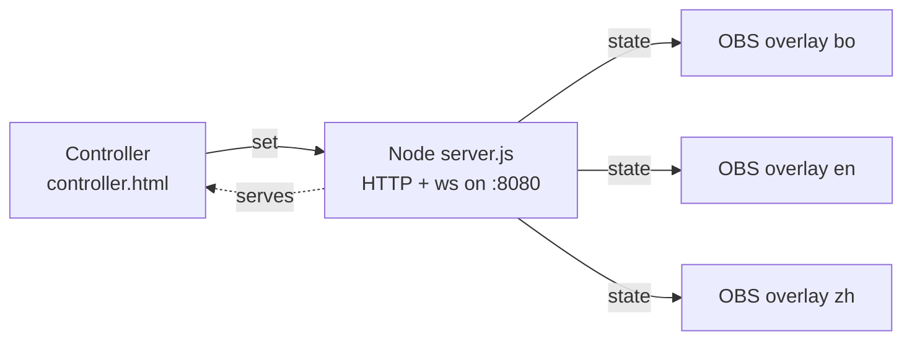
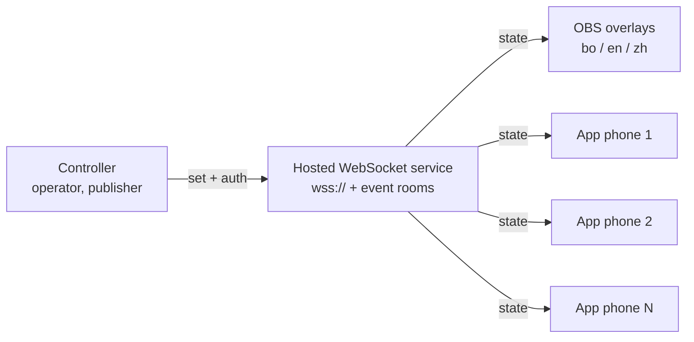

# Architecture & WebSocket handoff

For the developer taking over the overlay sync. This describes what exists today, the target design, and what needs building to add **in-app lyric-scroll** for in-person attendees.

## The idea in one line

One operator advances the puja on a controller. That position is broadcast to every subscriber at once: **OBS overlays** burn it into the language livestreams, and — the new part — the **WeBuddhist app** scrolls the liturgy on each in-person attendee's phone, lyrics-style (like Spotify / YouTube Music), so people in the room read along without watching video.

## Current design (works today, local only)

- `server.js` serves the pages and runs a WebSocket server. It holds one shared state object: `{ index, pass }` — the position in the flattened sequence and which round of the 21-Taras loop.
- **Controller → server:** `{ type: "set", index, pass }`.
- **Server → all clients:** `{ type: "state", index, pass }`, broadcast on every change. On connect, the server immediately sends current state so a late-joining overlay catches up.
- Overlays (`overlay.html?lang=…`) render the step at `index`; the flattened sequence comes from `content.json` via `sequence.js`.
- Everything runs on `localhost:8080` on the operator's machine.

## Target design (what to build)

Replace the local-only server with a **hosted WebSocket service** (public `wss://`, TLS) so the app can subscribe from anywhere in the room, and add the app as a new subscriber alongside OBS.

Design principles: **one publisher, many read-only subscribers; the message stays tiny; OBS overlays keep working unchanged.**

### 1. Roles & rooms

- **Publisher:** the controller only. Must authenticate (operator token); no one else may publish.
- **Subscribers:** OBS overlays and app clients — read-only.
- **Event room:** scope every message to an `eventId` (or room/channel) so more than one event can run without cross-talk, and so an app client subscribes to the right puja.

### 2. Message protocol (extends today's contract)

Keep the current shape so OBS overlays need no rewrite; add fields for auth, scoping, and stable identity.

| Direction | Message | Fields |
|-----------|---------|--------|
| Controller → service | `set` | `eventId`, `stepId`, `index`, `pass`, `authToken` |
| Service → subscribers | `state` | `eventId`, `stepId`, `index`, `pass`, `serverTime` |
| Both | `ping` / `pong` | heartbeat |
| Service → new subscriber | `state` | current state, sent immediately on connect (as today) |

**Add a stable `stepId`.** Today the position is a bare array `index`, which shifts if `content.json` is edited. OBS overlays and the app must agree on *which line* is active even across content edits, so give every sequence step a stable id (e.g. `refuge`, `tara-7`, `dedication-2`) derived from `content.json`, and broadcast that alongside `index`. The app maps `stepId` → its own rendering of that line; OBS can keep using `index`.

### 3. State & content ownership

- The **service** owns only the position (`stepId`/`index`/`pass`) — it stays tiny and text-agnostic.
- **OBS overlays** load their text from `content.json` (as now).
- **The app** renders the liturgy from its own content, keyed by `stepId`. Decide early: does the app reuse this repo's `content.json`, or its own store? Either works as long as the `stepId` scheme matches on both sides — that shared vocabulary is the contract.

### 4. In-app lyric-scroll behavior

On each `state` message the app:

- Scrolls the line for `stepId` to a focus position with a smooth animation, highlights it, dims the rest (lyrics-style).
- Shows the round number from `pass` during the 21-Taras loop (same lines repeat; only the counter advances).
- Handles operator **jumps** (clicking any line) as a scroll to that `stepId`.
- Offers a **manual-override / "follow"** toggle: if a user scrolls away to read ahead, stop auto-scrolling and show a "resync" button to snap back to the live position.
- On reconnect, requests/receives current state and resyncs (no assumption it stayed in order).

### 5. Transport, hosting, scale

- **`wss://` over TLS** is required — the app and any `https` overlay page can't use an insecure `ws://`.
- **Self-hosted Node `ws`** (full control, but you own reconnection, TLS, and fan-out) **vs a managed realtime service** (Pusher/Ably/Supabase Realtime — less ops, built-in presence/reconnect). For a room of dozens–hundreds of phones on one event, either works; managed buys you reconnection and scale for a small fee.
- **Latency target:** sub-second end to end, so the room's phones, the operator, and the video overlays stay visually in sync.
- **Reconnect:** heartbeat + auto-reconnect with resync is essential — phones sleep, wifi drops, and the puja runs for hours.

### 6. Security

- Operator publish token; subscribers read-only.
- Scope by `eventId`; validate it server-side.
- Rate-limit publishes; ignore malformed messages (the current server already ignores non-`set` / bad JSON — keep that).

## What the developer needs to build

1. A hosted `wss://` service with **event rooms**, **publisher auth**, and **read-only subscribers**, preserving the `set` / `state` contract.
2. A **stable `stepId`** scheme derived from the sequence, broadcast alongside `index`/`pass`.
3. **App subscriber + lyric-scroll UI**: subscribe to an event, auto-scroll/highlight by `stepId`, round counter from `pass`, jump handling, manual-override with resync, reconnection.
4. Point the existing **OBS overlays and controller** at the hosted `wss://` URL for production (they already fall back to `wss` when served over `https` — see `server.js` / the overlay connect logic). Local `node server.js` stays the dev path.

## Open questions (decide with Evan / the dev)

- Managed realtime service vs self-hosted `ws`?
- Does the app reuse this repo's `content.json`, or maintain its own liturgy keyed by the shared `stepId`s?
- One event at a time, or must the service support several concurrent pujas (rooms)?
- Where does the operator token come from, and how is an event created/started?
- In-room network: is there reliable wifi for a room of phones, or should the app tolerate flaky connections gracefully (it should)?
